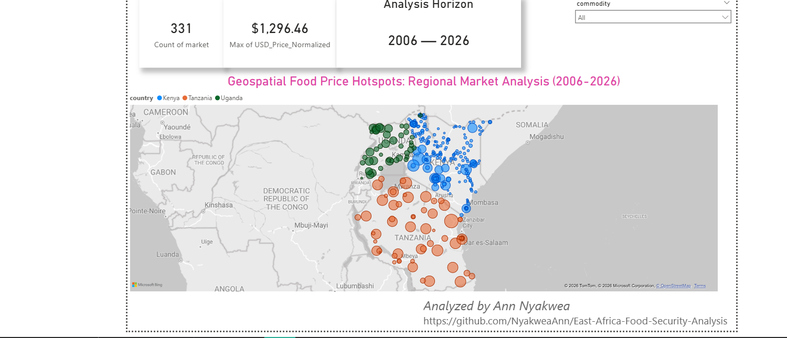
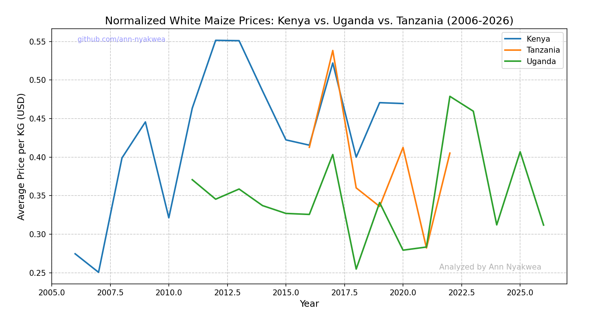
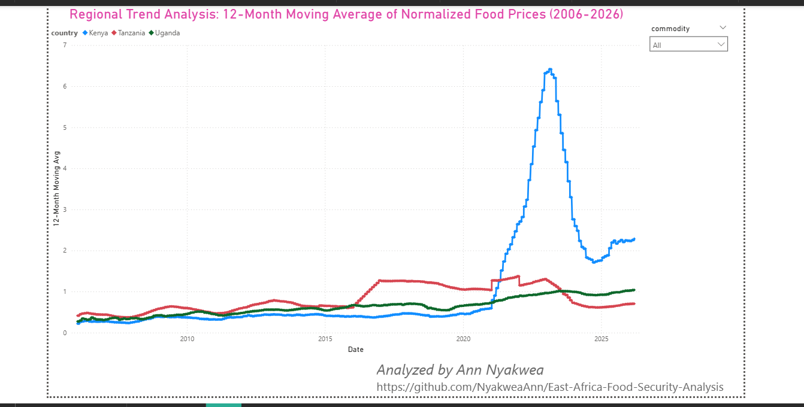

# 🌍 East Africa Food Security Analysis (2006-2026)

### **A Longitudinal Study of Market Volatility in Kenya, Uganda, and Tanzania**

## **Project Overview**
This project analyzes 20 years of regional food price volatility across the East African Community. Using humanitarian data from the World Food Programme (WFP), I engineered a dynamic decision-support tool to identify geospatial hotspots and longitudinal price trends for 331 distinct markets.

## **🛠️ Technical Implementation**
* **Data Engineering:** Engineered a multi-stage ETL process to merge multi-national datasets. Resolved critical data-type mismatches in Power Query to ensure calculation integrity.
* **Advanced Analytics (DAX):** Implemented **12-Month Moving Averages** to smooth seasonal volatility and created a custom **Calendar Table** for robust time-series intelligence.
* **Mathematical Normalization:** Standardized unit-of-measure discrepancies (converting 90KG wholesale units to 1KG retail metrics) and normalized prices to USD for cross-border comparability.
* **Geospatial Intelligence:** Leveraged coordinate data to build an interactive "Hotspot" interface, identifying vulnerable markets in real-time.

## 🧪 Exploratory Data Analysis (EDA)
Before final dashboarding, I utilized **Python (Matplotlib/Pandas)** to prototype regional price correlations. This allowed for rapid testing of price-per-KG normalization across different market clusters.

## **📈 Key Insights Found**

* **The 2022 Divergence:** While Tanzania and Uganda maintained relative price stability over the 20-year horizon, Kenya experienced a localized exponential spike in 2022.
* **Regional Correlation:** Despite different national currencies, price spikes in staples like maize are highly synchronized across the EAC corridor, highlighting regional market interdependence.
* **Data-First Integrity:** Identified and corrected a 90x scale error in raw data through unit normalization—a critical step for financial and humanitarian accuracy.

## **🧩 Technical Hurdles Overcome**
During development, I encountered a schema mismatch where normalized price metrics were imported as Strings, breaking DAX calculation logic. I resolved this at the Power Query layer by re-typing the metrics to Decimal format and establishing a Star Schema. 

---

**Analyzed by Ann Nyakwea** | [LinkedIn Profile](https://www.linkedin.com/in/nyakweaann/)
